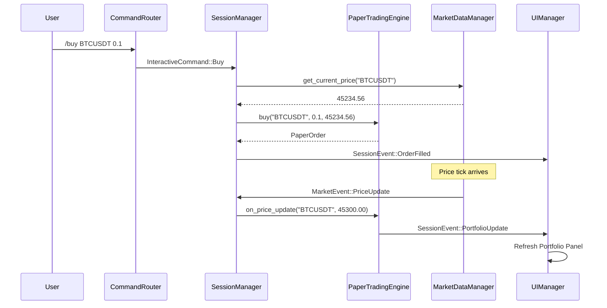

# Paper Trading 技术设计

本文档描述 XTrade Paper Trading（模拟交易）功能的技术设计，基于现有架构进行增量开发。

## 一、设计目标

- **零外部依赖**：纯内存实现，不需要 API Key、数据库
- **最小侵入**：复用现有 `MarketEvent`、`SessionEvent`、`InteractiveCommand` 体系
- **实时性**：持仓盈亏随行情 tick 实时更新
- **可扩展**：为 M4 真实交易 MVP 奠定基础

## 二、数据模型

### 2.1 订单模型

```rust
/// 订单方向
#[derive(Debug, Clone, Copy, PartialEq, Eq)]
pub enum OrderSide {
    Buy,
    Sell,
}

/// 订单状态
#[derive(Debug, Clone, Copy, PartialEq, Eq)]
pub enum OrderStatus {
    Pending,
    Filled,
    Cancelled,
}

/// Paper Trading 订单
#[derive(Debug, Clone)]
pub struct PaperOrder {
    /// 订单 ID（自增）
    pub id: u64,
    /// 交易对（如 BTCUSDT）
    pub symbol: String,
    /// 买/卖
    pub side: OrderSide,
    /// 数量
    pub quantity: f64,
    /// 成交价格（Market Order 立即成交）
    pub fill_price: f64,
    /// 订单状态
    pub status: OrderStatus,
    /// 创建时间（Unix ms）
    pub created_at: u64,
    /// 成交时间（Unix ms）
    pub filled_at: Option<u64>,
}
```

### 2.2 持仓模型

```rust
/// Paper Trading 持仓
#[derive(Debug, Clone)]
pub struct PaperPosition {
    /// 交易对
    pub symbol: String,
    /// 持仓数量（正数为多头）
    pub quantity: f64,
    /// 平均成本价
    pub avg_cost: f64,
    /// 当前市场价格（由行情更新）
    pub current_price: f64,
    /// 未实现盈亏
    pub unrealized_pnl: f64,
    /// 未实现盈亏百分比
    pub unrealized_pnl_pct: f64,
}

impl PaperPosition {
    /// 根据当前价格更新盈亏
    pub fn update_price(&mut self, price: f64) {
        self.current_price = price;
        self.unrealized_pnl = (price - self.avg_cost) * self.quantity;
        if self.avg_cost > 0.0 {
            self.unrealized_pnl_pct = (price - self.avg_cost) / self.avg_cost * 100.0;
        }
    }
}
```

### 2.3 Portfolio 状态

```rust
/// Paper Trading 账户状态
#[derive(Debug, Clone, Default)]
pub struct PaperPortfolio {
    /// 所有持仓
    pub positions: HashMap<String, PaperPosition>,
    /// 历史订单（最近 N 条）
    pub order_history: VecDeque<PaperOrder>,
    /// 下一个订单 ID
    next_order_id: u64,
    /// 总已实现盈亏
    pub realized_pnl: f64,
}
```

## 三、核心组件：PaperTradingEngine

### 3.1 职责

- 接收 `/buy`、`/sell` 命令，创建订单并立即撮合
- 监听 `MarketEvent::PriceUpdate`，更新持仓的当前价格与 PnL
- 维护 `PaperPortfolio` 状态
- 向 `ActionChannel` 发送 `SessionEvent::PortfolioUpdate` 事件

### 3.2 模块位置

```
src/
├── paper_trading/
│   ├── mod.rs              # 模块入口
│   ├── engine.rs           # PaperTradingEngine 实现
│   ├── models.rs           # PaperOrder, PaperPosition, PaperPortfolio
│   └── commands.rs         # 命令解析辅助
```

### 3.3 Engine 接口

```rust
pub struct PaperTradingEngine {
    portfolio: PaperPortfolio,
    /// 用于发送事件
    event_tx: mpsc::UnboundedSender<SessionEvent>,
}

impl PaperTradingEngine {
    /// 创建新引擎
    pub fn new(event_tx: mpsc::UnboundedSender<SessionEvent>) -> Self;

    /// 执行买入
    pub fn buy(&mut self, symbol: &str, quantity: f64, current_price: f64) -> Result<PaperOrder>;

    /// 执行卖出
    pub fn sell(&mut self, symbol: &str, quantity: f64, current_price: f64) -> Result<PaperOrder>;

    /// 处理价格更新，刷新持仓 PnL
    pub fn on_price_update(&mut self, symbol: &str, price: f64);

    /// 获取当前 Portfolio 快照
    pub fn portfolio(&self) -> &PaperPortfolio;

    /// 获取指定 symbol 的持仓
    pub fn position(&self, symbol: &str) -> Option<&PaperPosition>;
}
```

### 3.4 撮合逻辑（Market Order）

```rust
fn execute_order(&mut self, side: OrderSide, symbol: &str, qty: f64, price: f64) -> PaperOrder {
    let order = PaperOrder {
        id: self.portfolio.next_order_id(),
        symbol: symbol.to_string(),
        side,
        quantity: qty,
        fill_price: price,
        status: OrderStatus::Filled,
        created_at: now_ms(),
        filled_at: Some(now_ms()),
    };

    // 更新持仓
    let position = self.portfolio.positions.entry(symbol.to_string())
        .or_insert_with(|| PaperPosition::new(symbol));

    match side {
        OrderSide::Buy => {
            // 加仓：重新计算平均成本
            let total_cost = position.avg_cost * position.quantity + price * qty;
            position.quantity += qty;
            position.avg_cost = total_cost / position.quantity;
        }
        OrderSide::Sell => {
            // 减仓：实现盈亏
            let pnl = (price - position.avg_cost) * qty;
            self.portfolio.realized_pnl += pnl;
            position.quantity -= qty;
            // 如果持仓为零，可选择移除
        }
    }

    // 记录订单历史
    self.portfolio.order_history.push_back(order.clone());

    // 发送更新事件
    let _ = self.event_tx.send(SessionEvent::PortfolioUpdate {
        portfolio: self.portfolio.clone(),
    });

    order
}
```

## 四、命令扩展

### 4.1 InteractiveCommand 扩展

在 `src/session/command_router.rs` 中新增：

```rust
pub enum InteractiveCommand {
    // ... 现有命令 ...

    /// 模拟买入
    Buy { symbol: String, quantity: f64 },
    /// 模拟卖出
    Sell { symbol: String, quantity: f64 },
    /// 查看持仓
    Portfolio,
    /// 查看订单历史
    Orders,
}
```

### 4.2 命令解析

```rust
"/buy" => {
    // /buy BTCUSDT 0.1
    if parts.len() < 3 {
        return Err(anyhow!("Usage: /buy <symbol> <quantity>"));
    }
    let symbol = parts[1].to_uppercase();
    let quantity: f64 = parts[2].parse()?;
    Ok(Some(InteractiveCommand::Buy { symbol, quantity }))
}

"/sell" => {
    // /sell BTCUSDT 0.05
    if parts.len() < 3 {
        return Err(anyhow!("Usage: /sell <symbol> <quantity>"));
    }
    let symbol = parts[1].to_uppercase();
    let quantity: f64 = parts[2].parse()?;
    Ok(Some(InteractiveCommand::Sell { symbol, quantity }))
}

"/portfolio" | "/pf" => Ok(Some(InteractiveCommand::Portfolio)),
"/orders" => Ok(Some(InteractiveCommand::Orders)),
```

### 4.3 SessionManager 处理

在 `handle_command` 中新增分支：

```rust
InteractiveCommand::Buy { symbol, quantity } => {
    // 获取当前价格
    if let Some(price) = self.get_current_price(&symbol) {
        let order = self.paper_engine.buy(&symbol, quantity, price)?;
        self.action_channel.send_event(SessionEvent::OrderFilled { order })?;
    } else {
        self.action_channel.send_error(format!("No price data for {}", symbol))?;
    }
}

InteractiveCommand::Sell { symbol, quantity } => {
    // 类似处理
}

InteractiveCommand::Portfolio => {
    let portfolio = self.paper_engine.portfolio().clone();
    self.action_channel.send_event(SessionEvent::PortfolioSnapshot { portfolio })?;
}
```

## 五、SessionEvent 扩展

在 `src/session/action_channel.rs` 中新增：

```rust
pub enum SessionEvent {
    // ... 现有事件 ...

    /// 订单成交通知
    OrderFilled { order: PaperOrder },

    /// Portfolio 更新（价格变动触发）
    PortfolioUpdate { portfolio: PaperPortfolio },

    /// Portfolio 快照（响应 /portfolio 命令）
    PortfolioSnapshot { portfolio: PaperPortfolio },

    /// 订单历史快照
    OrderHistorySnapshot { orders: Vec<PaperOrder> },
}
```

## 六、TUI 面板设计

### 6.1 Portfolio 面板

新增 `src/ui/tui/render/portfolio.rs`：

```
┌─ Portfolio ─────────────────────────────────────────────────────┐
│ Symbol      Qty        Avg Cost    Price       PnL        PnL%  │
├─────────────────────────────────────────────────────────────────┤
│ BTCUSDT     0.1000     45,000.00   45,234.56   +23.46    +0.52% │
│ ETHUSDT     1.5000      2,300.00    2,280.00   -30.00    -1.30% │
├─────────────────────────────────────────────────────────────────┤
│ Total Unrealized PnL: -6.54 USD                                 │
│ Total Realized PnL:   +150.00 USD                               │
└─────────────────────────────────────────────────────────────────┘
```

### 6.2 渲染逻辑

```rust
pub fn render_portfolio(f: &mut Frame, area: Rect, portfolio: &PaperPortfolio) {
    let rows: Vec<Row> = portfolio.positions.values()
        .map(|p| {
            let pnl_style = if p.unrealized_pnl >= 0.0 {
                Style::default().fg(Color::Green)
            } else {
                Style::default().fg(Color::Red)
            };
            Row::new(vec![
                Cell::from(p.symbol.clone()),
                Cell::from(format!("{:.4}", p.quantity)),
                Cell::from(format!("{:.2}", p.avg_cost)),
                Cell::from(format!("{:.2}", p.current_price)),
                Cell::from(format!("{:+.2}", p.unrealized_pnl)).style(pnl_style),
                Cell::from(format!("{:+.2}%", p.unrealized_pnl_pct)).style(pnl_style),
            ])
        })
        .collect();

    let table = Table::new(rows, &[
        Constraint::Length(10),
        Constraint::Length(10),
        Constraint::Length(12),
        Constraint::Length(12),
        Constraint::Length(12),
        Constraint::Length(8),
    ])
    .header(Row::new(vec!["Symbol", "Qty", "Avg Cost", "Price", "PnL", "PnL%"]))
    .block(Block::default().title("Portfolio").borders(Borders::ALL));

    f.render_widget(table, area);
}
```

### 6.3 面板切换

在现有 TUI 布局中，可通过快捷键（如 `Tab`）或新增 `/panel portfolio` 命令切换到 Portfolio 面板。

## 七、事件流集成



## 八、实现步骤

### Phase 1: 数据模型（Day 1）
- [x] 创建 `src/paper_trading/mod.rs`
- [x] 实现 `models.rs`（PaperOrder, PaperPosition, PaperPortfolio）
- [x] 单元测试

### Phase 2: Engine 核心（Day 2-3）
- [x] 实现 `engine.rs`（PaperTradingEngine）
- [x] 买入/卖出逻辑
- [x] 价格更新触发 PnL 刷新
- [x] 单元测试

### Phase 3: 命令集成（Day 4）
- [ ] 扩展 `InteractiveCommand`
- [ ] 扩展 `CommandRouter` 解析
- [ ] 扩展 `SessionEvent`
- [ ] `SessionManager` 集成 `PaperTradingEngine`

### Phase 4: TUI 面板（Day 5-6）
- [ ] 实现 `render/portfolio.rs`
- [ ] 集成到 UI 布局
- [ ] 快捷键/命令切换面板

### Phase 5: 测试与优化（Day 7）
- [ ] 端到端测试
- [ ] 性能验证（PnL 更新延迟）
- [ ] 文档更新

## 九、未来扩展（M2/M4）

| 功能        | Milestone | 说明                            |
| ----------- | --------- | ------------------------------- |
| Limit Order | M4        | 需要价格匹配逻辑                |
| 持仓持久化  | M2        | SQLite 存储                     |
| 真实下单    | M4        | 替换 Engine 为 Binance API 调用 |
| 多账户      | M5        | 支持多策略独立账户              |

## 十、风险与缓解

| 风险                      | 缓解措施                           |
| ------------------------- | ---------------------------------- |
| 价格获取失败              | 下单前检查价格可用性，返回明确错误 |
| 高频 PnL 更新导致性能问题 | 批量更新 + 渲染节流                |
| 用户误操作大额下单        | 可选：添加确认提示或数量上限配置   |
